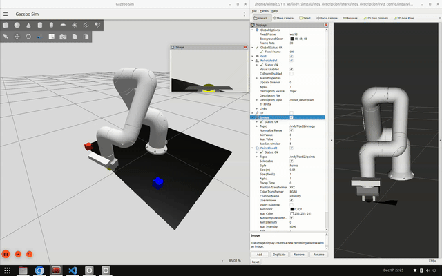
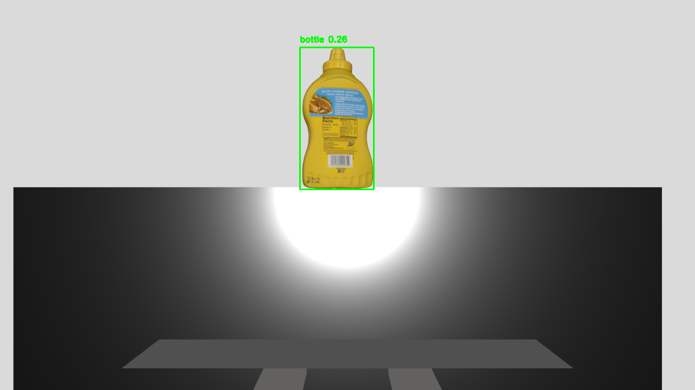

# 🦾 Indy7 OpenVLA & Gripper Simulation

This package (`indy_openvla`) provides a Gazebo-based simulation environment for the Indy7 robot arm. It includes a fully functional 2-finger gripper, `ros2_control` integration, and a custom world with graspable objects for Pick & Place tasks.

<div align="center">
  <h3>📸 Initial Simulation State</h3>
  
</div>

<br>

### 🎥 Demo Video
<div align="center">
  <h3>🎥 Simulation Preview</h3>
  
</div>

---

## 🚀 Quick Start

### 1. Launch Simulation
Open a terminal and run the main launch file. This starts Gazebo, the robot model (URDF), and the trajectory controllers.

**Command:**
`ros2 launch indy_openvla indy_openvla_gazebo_base.launch.py`

> **Note:** Wait until you see the log message: `[joint_trajectory_controller]: Active`

---

## 🎮 Control Guide

### Method A: Interactive Cartesian Control with RPY (Recommended)
Use the `indy7_move_to_xyz.py` script for precise 3D positioning and orientation control using Inverse Kinematics (IK).

| Feature | Description |
| :--- | :--- |
| **Execution** | `python3 indy7_move_to_xyz.py` |
| **IK Engine** | Automatically maps XYZ+RPY to 8-joint commands |
| **Orientation Control** | Full Roll-Pitch-Yaw control in radians |
| **Safe Limits** | Gripper open: 0.038m / Close: 0.001m |
| **State Sync** | Real-time synchronization via `/joint_states` |

**Terminal Commands:**
* `x y z`: Move to target coordinates (e.g., `0.5 0.0 0.4`)
* `x y z r p y`: Move with orientation control (e.g., `0.5 0.0 0.4 0 1.57 0`)
* `home`: Return to safe default pose
* `open` / `close`: Toggle gripper state
* `pos`: Show current TCP position and orientation

**RPY Examples:**
* `0 1.57 0` - Gripper pointing downward (90° pitch)
* `0 0 0` - Gripper horizontal
* `1.57 0 0` - Gripper rotated 90° roll

### Method B: Manual CLI Control
**1. Set Parameters:**
`ros2 param set /joint_trajectory_controller allow_partial_joints_goal true`

**2. Publish Topic:**
`ros2 topic pub --once /joint_trajectory_controller/joint_trajectory trajectory_msgs/msg/JointTrajectory "{joint_names: ['left_finger_joint', 'right_finger_joint'], points: [{positions: [0.04, 0.04], time_from_start: {sec: 3, nanosec: 0}}]}"`

---

## 🤖 Real-time Object Detection with YOLO

The `yolo_grasping.py` script provides real-time object detection using YOLOv8n with ROS2 integration for autonomous grasping.

<div align="center">
  <h3>🎯 Object Detection Example</h3>
  
</div>

### Features
* **Model:** YOLOv8n (nano) - optimized for CPU performance
* **Detection:** All 80 COCO classes (person, chair, cup, etc.)
* **3D Localization:** Integrates PointCloud data for robot base coordinates
* **Real-time Display:** Live bounding boxes with confidence scores and distance

### Usage
**Command:**
```bash
python3 yolo_grasping.py
```

**Topics:**
* Subscribes to: `/indy7/zed2i/image` (RGB camera)
* Subscribes to: `/indy7/zed2i/points` (PointCloud2)

**Output:**
* Live OpenCV window showing detected objects
* Bounding boxes with labels and confidence scores
* 3D coordinates (X, Y, Z) in robot base frame
* Distance information when PointCloud is available

**Performance:**
* Confidence threshold: 0.2 (adjustable)
* Image resolution: 416x416 (balanced speed/accuracy)
* Frame rate: Real-time on CPU

---

## 🌍 Simulation World
The environment (`camera_world.sdf`) includes graspable objects:

* 🍯 **Mustard Bottle:** x=0.5, y=0.0, z=0.05 (rotated 90° pitch)

> **Note:** Previous versions included colored cubes (Red, Blue, Yellow Cylinder). The world has been updated to use a realistic mustard bottle model for more practical grasping scenarios.

---

## 🛠️ Technical Details & Updates
1. **Kinematic Chain:** Added fixed `tcp_gripper_joint` for stable RViz transforms.
2. **Interfaces:** Full `position`/`velocity` support for all 8 joints.
3. **Mimic Logic:** `right_finger_joint` mirrors `left_finger_joint` for easy grasping.
4. **Physics Safety:** Enforced limits (0.0m - 0.04m) to prevent Gazebo explosions.