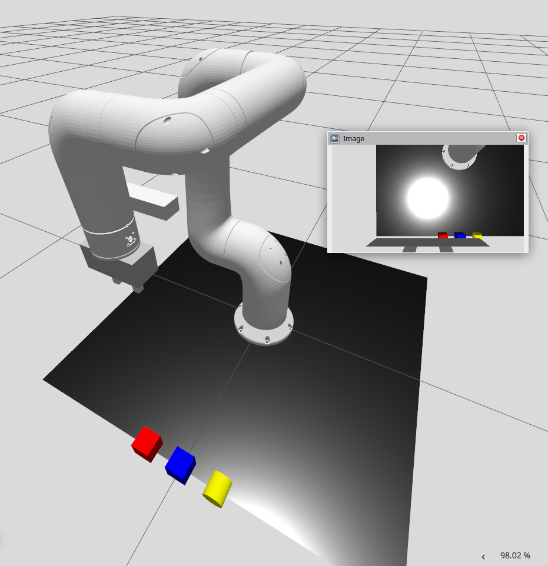

# 🦾 Indy7 OpenVLA & Gripper Simulation

This package (`indy_openvla`) provides a Gazebo-based simulation environment for the Indy7 robot arm. It includes a fully functional 2-finger gripper, `ros2_control` integration, and a custom world with graspable objects for Pick & Place tasks.

<div align="center">
  <h3>📸 Initial Simulation State</h3>
  
</div>
---

### 🎥 Demo Video
Click the link below to watch the cylinder pick & place demonstration:
> **[▶️ Watch the Demo Video (Cylinder_Pick&Place.mp4)](Cylinder_Pick&Place.mp4)**

---

## 🚀 Quick Start

### 1. Launch Simulation
Open a terminal and run the main launch file. This starts Gazebo, the robot model (URDF), and the trajectory controllers.

```bash
ros2 launch indy_openvla indy_openvla_gazebo_base.launch.py
```
> **Wait** until you see the log: `[joint_trajectory_controller]: Active`

---

## 🎮 Control Guide

### Method A: Gripper Only (Recommended)
This method allows you to control the fingers independently without sending commands to the arm joints.

**1. Configure Controller (Run Once)**
Open a new terminal and set the partial goal parameter:
```bash
ros2 param set /joint_trajectory_controller allow_partial_joints_goal true
```

**2. Open Gripper**
```bash
ros2 topic pub --once /joint_trajectory_controller/joint_trajectory trajectory_msgs/msg/JointTrajectory "{
  joint_names: ['left_finger_joint', 'right_finger_joint'],
  points: [{
    positions: [0.05, 0.05],
    time_from_start: {sec: 3, nanosec: 0}
  }]
}"
```

**3. Close Gripper**
```bash
ros2 topic pub --once /joint_trajectory_controller/joint_trajectory trajectory_msgs/msg/JointTrajectory "{
  joint_names: ['left_finger_joint', 'right_finger_joint'],
  points: [{
    positions: [0.0, 0.0],
    time_from_start: {sec: 3, nanosec: 0}
  }]
}"
```

### Method B: Reach Object (Red Cube)
Sends the robot to a pre-calculated position to hover over the red cube.

```bash
ros2 topic pub --once /joint_trajectory_controller/joint_trajectory trajectory_msgs/msg/JointTrajectory "{
  joint_names: [
    'joint0', 'joint1', 'joint2', 'joint3', 'joint4', 'joint5',
    'left_finger_joint', 'right_finger_joint'
  ],
  points: [{
    positions: [-0.2, -0.5, -1.5, 0.0, -1.1, 0.0, 0.05, 0.05],
    time_from_start: {sec: 4, nanosec: 0}
  }]
}"
```

---

## 🌍 Simulation World
The environment (`camera_world.sdf`) has been modified to include graspable objects located in front of the robot:
* **🟥 Red Cube:** x=0.5, y=-0.1
* **🟦 Blue Cube:** x=0.5, y=0.0
* **🟨 Yellow Cylinder:** x=0.5, y=0.1 (Replaces the original yellow cube)

---

## 🛠️ Technical Details & Updates
This package implements several critical fixes to ensure stability in ROS 2 Jazzy / Gazebo:

1.  **Kinematic Chain Repair:**
    * Added `tcp_gripper_joint` (fixed) to connect `tcp` link to the gripper.
    * Resolved "No transform" errors in RViz for the end-effector.
2.  **ROS 2 Control Interfaces:**
    * Added `position` and `velocity` state/command interfaces to `indy.ros2_control.xacro`.
    * Fixed `joint_trajectory_controller` activation failures.
3.  **Controller Optimization:**
    * Implemented Mimic Joint logic: The `right_finger_joint` now mimics the `left_finger_joint`.
    * Simplified control commands to a single input if desired.
4.  **Hardware Limits:**
    * Enforced physical limits (0.0m ~ 0.04m) on prismatic joints to prevent physics engine explosions.
