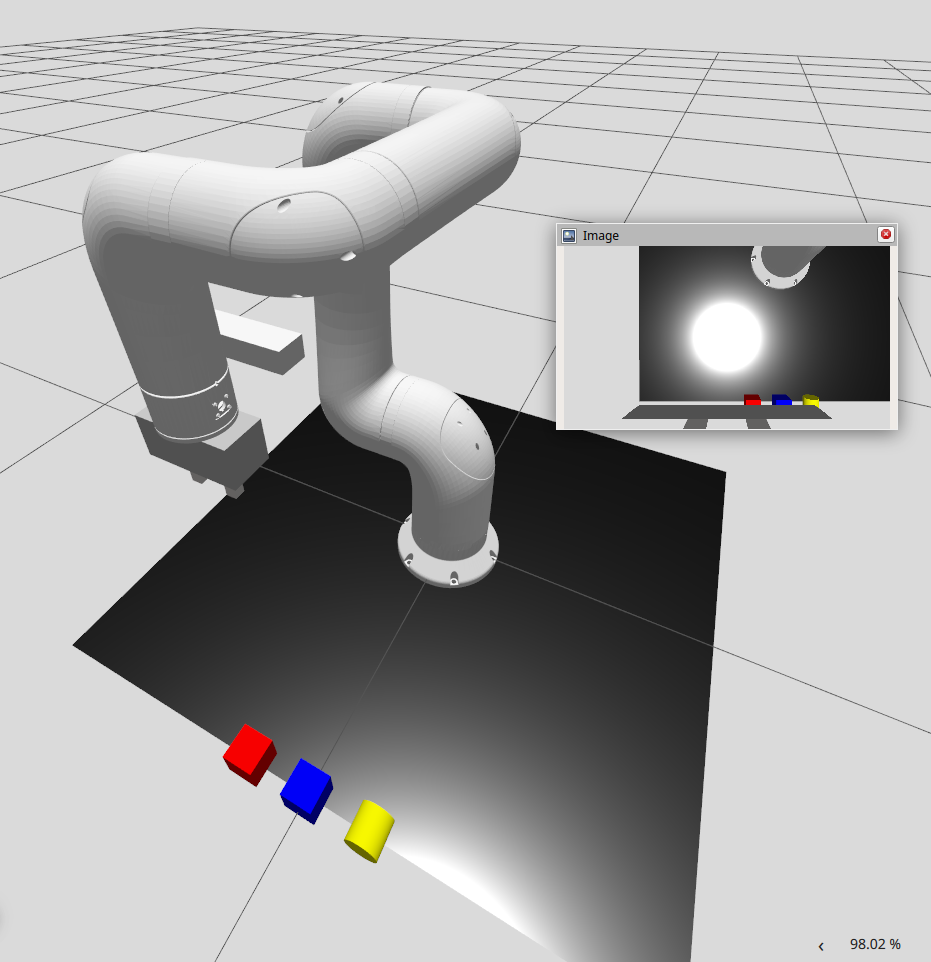
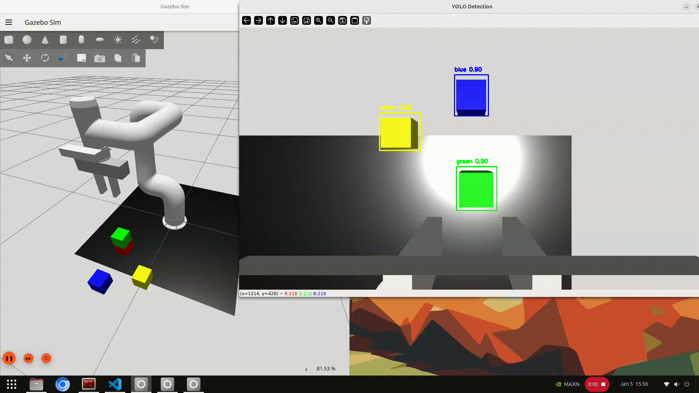
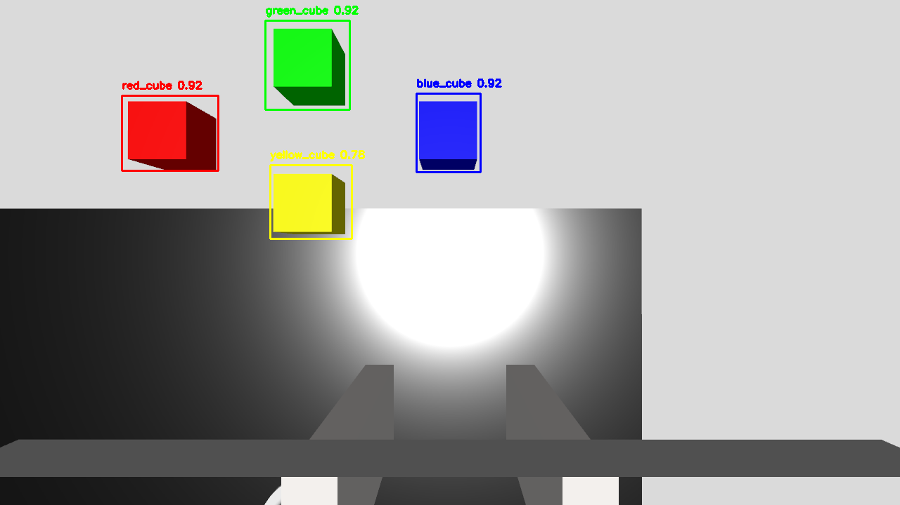

# 🦾 Indy7 OpenVLA Simulation with MoveIt

Gazebo simulation environment for Indy7 robot arm with **MoveIt motion planning**, 2-finger gripper, YOLO object detection, and ros2_control integration.

## ✨ Key Features
- 🎯 **MoveIt Integration** - Visual motion planning with collision detection
- 🤖 **YOLO Detection** - Real-time object detection with 3D localization
- 🦾 **Dual Controllers** - Separate arm (6 DOF) and gripper (2 DOF) control
- 📷 **ZED2i Camera** - RGB + PointCloud simulation
- 🎮 **Multiple Control Methods** - MoveIt GUI, Python IK script, or CLI

<div align="center">
  
  <p><i>Initial simulation state with colored cubes</i></p>
</div>

<div align="center">
  
  <p><i>YOLO-based autonomous cube grasping demonstration</i></p>
</div>

---

## 💻 System Requirements

### Base System (ROS2 Environment)
```
OS: Ubuntu 24.04.3 LTS (Noble Numbat)
Kernel: 6.8.12-tegra
ROS2: Jazzy
Gazebo: 8.10.0
GPU: NVIDIA Thor (CUDA 13.0)
```

### Python Environment 
```
Python: 3.12.12
PyTorch: 2.9.1+cpu (CPU-only, no CUDA backend)
NumPy: 1.26.4 (< 2.0 for cv_bridge compatibility)
OpenCV: 4.12.0.88
Ultralytics: 8.3.241 (YOLOv8)
ikpy: 3.4.2
scipy: 1.16.3
rclpy: 7.1.6
```

**Note:** YOLO runs on CPU due to torchvision lacking CUDA backend support on NVIDIA Thor.

---

## 🚀 Quick Start

```bash
# Launch simulation (MoveIt enabled by default)
ros2 launch indy_openvla indy_openvla_gazebo_base.launch.py

# Launch options
ros2 launch indy_openvla indy_openvla_gazebo_base.launch.py launch_moveit:=false  # Disable MoveIt
ros2 launch indy_openvla indy_openvla_gazebo_base.launch.py launch_rviz:=false    # Disable RViz
```

**Wait for:** `[joint_trajectory_controller]: Active` and `[gripper_controller]: Active`

---

## 🎮 Control Methods

### 🎯 Method A: YOLO Vision-Based Grasping (Recommended)

**Autonomous pick and place with YOLO object detection**

```bash
python3 yolo/yolo_moveit_grasping_new.py
```

**Keyboard Controls:**
- **r/y/g/b** - Select cube color (red/yellow/green/blue)
- **m** - Move to selected cube (pre-grasp position, 25cm above)
- **a** - Descend 15cm and grasp (close gripper)
- **h** - Return to home position (with gripper cycle)

**Features:**
- Real-time YOLO cube detection
- HSV-based color classification
- 3D position estimation from point cloud
- Automatic IK calculation with joint limit validation
- Gripper pointing down (RPY: 0, 3.14, 0)

**Workflow:**
1. Launch simulation
2. Run YOLO grasping script
3. Press color key to select target cube
4. Press 'm' to move above cube
5. Press 'a' to descend and grasp
6. Press 'h' to return home

---

### 🎯 Method B: MoveIt GUI

**Visual motion planning with collision avoidance**

1. Launch simulation (MoveIt enabled by default)
2. In RViz "MotionPlanning" panel:
   - Drag interactive marker to set goal
   - Click **Plan** → **Execute**
3. Planning group: `indy_manipulator` (6 DOF arm)
4. Gripper: Use separate `gripper_controller`

**Features:** OMPL planner, collision detection, trajectory visualization

---

### 🎯 Method C: Python IK Script

**Direct XYZ + RPY control with inverse kinematics**

```bash
python3 indy7_move_to_xyz.py
```

**Commands:**
```
0.5 0.0 0.4              # Move to XYZ
0.5 0.0 0.4 0 1.57 0     # Move with RPY (pitch down 90°)
home                     # Return to home position
open / close             # Control gripper
pos                      # Show current pose
```

**RPY Examples:**
- `0 1.57 0` - Gripper down (90° pitch)
- `0 0 0` - Gripper horizontal
- `1.57 0 0` - Gripper rotated (90° roll)

---

### ⚙️ Method D: ROS2 CLI

**Manual topic publishing for advanced users**

```bash
# Enable partial goals
ros2 param set /joint_trajectory_controller allow_partial_joints_goal true

# Control gripper
ros2 topic pub --once /joint_trajectory_controller/joint_trajectory \
  trajectory_msgs/msg/JointTrajectory \
  "{joint_names: ['left_finger_joint', 'right_finger_joint'], \
    points: [{positions: [0.04, 0.04], time_from_start: {sec: 3}}]}"
```

---

## 🤖 YOLO Object Detection

**Real-time object detection with 3D localization**

<div align="center">
  
  <p><i>Custom YOLOv8 detecting colored cubes with 3D coordinates</i></p>
</div>


### Specifications
| Feature | Details |
|---------|----------|
| **Model** | Custom YOLOv8 trained on cube dataset |
| **Classes** | Cube detection |
| **Color Detection** | HSV-based post-processing (red/yellow/green/blue) |
| **Input Topics** | `/indy7/zed2i/image` (RGB)<br>`/indy7/zed2i/points` (PointCloud2) |
| **Output** | Bounding boxes + 3D coordinates + color labels |
| **Confidence** | 0.2 threshold |
| **Resolution** | 416x416 |

### Training Dataset
**Source:** [Roboflow Cube Detection Dataset](https://universe.roboflow.com/roboticarm/cube-pr1ld)

**Dataset Details:**
- Trained on red, green, and blue cubes
- 4 augmented outputs per training example

**Augmentations Applied:**
- Flip: Horizontal
- Crop: 0-20% zoom
- Saturation: ±25%
- Brightness: ±15%
- Exposure: ±10%
- Blur: Up to 2.5px
- Noise: Up to 0.1% of pixels

**Note:** Model trained on green cubes but generalizes well to yellow cubes due to similar brightness/saturation characteristics in augmented training data.|

### Output
- Live OpenCV window with detections
- Object labels with confidence scores
- 3D position (X, Y, Z) in robot base frame
- Distance from camera

---

## 🌍 Simulation Environment

**World:** `camera_world.sdf` - Grasping practice world with colored cubes

**Objects:**
- 🟥 **Red Cube** at (0.6, 0.2, 0.04) - 8cm cube
- 🟨 **Yellow Cube** at (0.5, 0.0, 0.025) - 8cm cube  
- 🟦 **Blue Cube** at (0.6, -0.2, 0.04) - 8cm cube
- 🟩 **Green Cube** at (0.7, 0.0, 0.04) - 8cm cube

**Features:**
- Primitive geometry (no mesh files needed)
- Color-coded for vision-based manipulation
- YOLO detects cubes, HSV post-processing identifies colors
- Supports red, yellow, green, and blue cube detection
- Ideal for pick-and-place practice

**Physics:**
- Mass: 0.1 kg per cube
- Dynamic objects (not static)
- Proper inertia for realistic grasping

---

## 🛠️ Technical Details

### Architecture
- **YOLO Vision:** Custom YOLOv8 + HSV color detection + Point cloud processing
- **IK Solver:** ikpy with current joint state as initial guess
- **MoveIt:** OMPL motion planning with collision detection
- **Controllers:** 
  - `joint_trajectory_controller` - 6 DOF arm (joint0-5)
  - `gripper_controller` - 2 DOF gripper (left/right fingers)
- **Kinematics:** Fixed `tcp_gripper_joint` for stable transforms
- **Interfaces:** Position + velocity for all 8 joints
- **Safety:** Gripper limits 0.0-0.04m, joint limit validation

### YOLO Grasping Pipeline
1. **Detection:** YOLO detects cubes in RGB image
2. **Color Classification:** HSV thresholding identifies cube color
3. **3D Localization:** Average point cloud points within bounding box
4. **TF Transform:** Convert camera frame to robot base frame (link0)
5. **IK Calculation:** Compute joint angles for target pose (gripper down)
6. **Motion Execution:** Send joint trajectory to controller

### Known Issues
⚠️ **Gripper initialization:** First command may only move one finger
- **Workaround:** Move arm first OR send gripper command twice
- **Cause:** Gazebo physics engine initialization timing

---

## 📚 Additional Resources

- **Package:** `indy_openvla`
- **Robot:** Indy7 v2 (6 DOF arm + 2 DOF gripper)
- **Simulation:** Gazebo with ros2_control
- **Planning:** MoveIt2 with OMPL