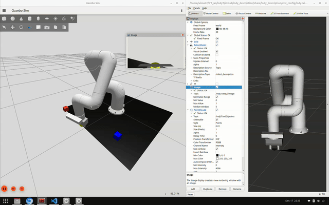
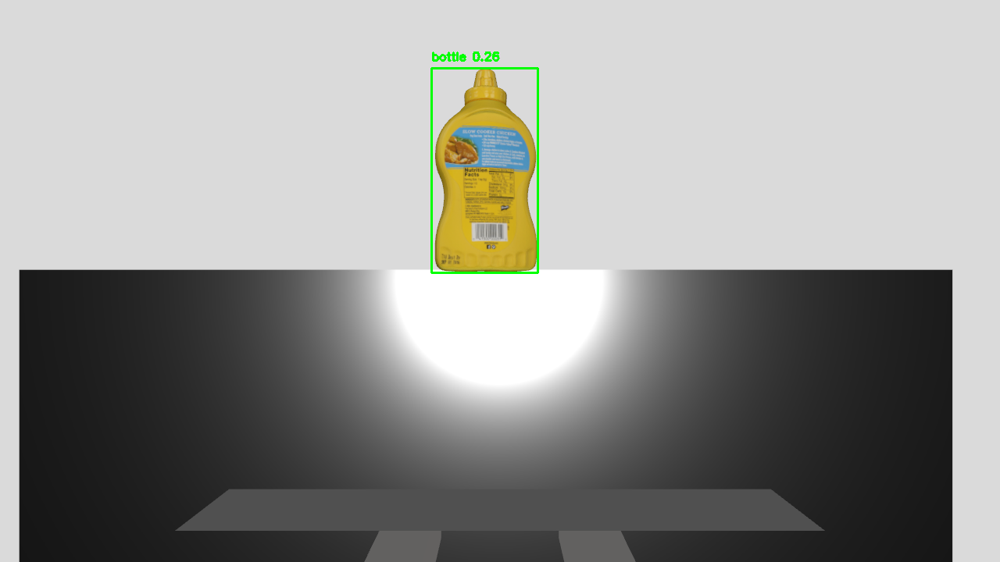

# 🦾 Indy7 OpenVLA Simulation with MoveIt

Gazebo simulation environment for Indy7 robot arm with **MoveIt motion planning**, 2-finger gripper, YOLO object detection, and ros2_control integration.

## ✨ Key Features
- 🎯 **MoveIt Integration** - Visual motion planning with collision detection
- 🤖 **YOLO Detection** - Real-time object detection with 3D localization
- 🦾 **Dual Controllers** - Separate arm (6 DOF) and gripper (2 DOF) control
- 📷 **ZED2i Camera** - RGB + PointCloud simulation
- 🎮 **Multiple Control Methods** - MoveIt GUI, Python IK script, or CLI

<div align="center">
  
  <p><i>Initial simulation state with mustard bottle</i></p>
</div>

<div align="center">
  
  <p><i>Autonomous pick and place demonstration</i></p>
</div>

---

## 💻 System Requirements

### Base System (ROS2 Environment)
```
OS: Ubuntu 24.04.3 LTS (Noble Numbat)
Kernel: 6.8.12-tegra
ROS2: Jazzy
Gazebo: 8.10.0
GPU: NVIDIA Thor (CUDA 13.0)
```

### Python Environment (Conda: vla)
```
Python: 3.12.12
PyTorch: 2.9.1+cpu (CPU-only, no CUDA backend)
NumPy: 1.26.4 (< 2.0 for cv_bridge compatibility)
OpenCV: 4.12.0.88
Ultralytics: 8.3.241 (YOLOv8)
ikpy: 3.4.2
scipy: 1.16.3
rclpy: 7.1.6
```

**Note:** YOLO runs on CPU due to torchvision lacking CUDA backend support on NVIDIA Thor.

---

## 🚀 Quick Start

```bash
# Launch simulation (MoveIt enabled by default)
ros2 launch indy_openvla indy_openvla_gazebo_base.launch.py

# Launch options
ros2 launch indy_openvla indy_openvla_gazebo_base.launch.py launch_moveit:=false  # Disable MoveIt
ros2 launch indy_openvla indy_openvla_gazebo_base.launch.py launch_rviz:=false    # Disable RViz
```

**Wait for:** `[joint_trajectory_controller]: Active` and `[gripper_controller]: Active`

---

## 🎮 Control Methods

### 🎯 Method A: MoveIt (Recommended)

**Visual motion planning with collision avoidance**

1. Launch simulation (MoveIt enabled by default)
2. In RViz "MotionPlanning" panel:
   - Drag interactive marker to set goal
   - Click **Plan** → **Execute**
3. Planning group: `indy_manipulator` (6 DOF arm)
4. Gripper: Use separate `gripper_controller`

**Features:** OMPL planner, collision detection, trajectory visualization

---

### 💻 Method B: Python IK Script

**Direct XYZ + RPY control with inverse kinematics**

```bash
python3 indy7_move_to_xyz.py
```

**Commands:**
```
0.5 0.0 0.4              # Move to XYZ
0.5 0.0 0.4 0 1.57 0     # Move with RPY (pitch down 90°)
home                     # Return to home position
open / close             # Control gripper
pos                      # Show current pose
```

**RPY Examples:**
- `0 1.57 0` - Gripper down (90° pitch)
- `0 0 0` - Gripper horizontal
- `1.57 0 0` - Gripper rotated (90° roll)

---

### ⚙️ Method C: ROS2 CLI

**Manual topic publishing for advanced users**

```bash
# Enable partial goals
ros2 param set /joint_trajectory_controller allow_partial_joints_goal true

# Control gripper
ros2 topic pub --once /joint_trajectory_controller/joint_trajectory \
  trajectory_msgs/msg/JointTrajectory \
  "{joint_names: ['left_finger_joint', 'right_finger_joint'], \
    points: [{positions: [0.04, 0.04], time_from_start: {sec: 3}}]}"
```

---

## 🤖 YOLO Object Detection

**Real-time object detection with 3D localization**

<div align="center">
  
  <p><i>YOLOv8n detecting objects with 3D coordinates</i></p>
</div>

### Usage
```bash
# Activate conda environment first
conda activate vla
python3 yolo_grasping.py
```

### Specifications
| Feature | Details |
|---------|----------|
| **Model** | YOLOv8n (CPU optimized) |
| **Classes** | 80 COCO classes |
| **Input Topics** | `/indy7/zed2i/image` (RGB)<br>`/indy7/zed2i/points` (PointCloud2) |
| **Output** | Bounding boxes + 3D coordinates |
| **Confidence** | 0.2 threshold |
| **Resolution** | 416x416 |

### Output
- Live OpenCV window with detections
- Object labels with confidence scores
- 3D position (X, Y, Z) in robot base frame
- Distance from camera

---

## 🌍 Simulation Environment

**World:** `camera_world.sdf`

**Objects:**
- 🍯 Mustard Bottle at (0.5, 0.0, 0.05) - rotated 90° pitch

> Previous versions used colored cubes. Updated to realistic mustard bottle for better grasping practice.

---

## 🛠️ Technical Details

### Architecture
- **MoveIt:** OMPL motion planning with collision detection
- **Controllers:** 
  - `joint_trajectory_controller` - 6 DOF arm (joint0-5)
  - `gripper_controller` - 2 DOF gripper (left/right fingers)
- **Kinematics:** Fixed `tcp_gripper_joint` for stable transforms
- **Interfaces:** Position + velocity for all 8 joints
- **Safety:** Gripper limits 0.0-0.04m

### Known Issues
⚠️ **Gripper initialization:** First command may only move one finger
- **Workaround:** Move arm first OR send gripper command twice
- **Cause:** Gazebo physics engine initialization timing

---

## 📚 Additional Resources

- **Package:** `indy_openvla`
- **Robot:** Indy7 v2 (6 DOF arm + 2 DOF gripper)
- **Simulation:** Gazebo with ros2_control
- **Planning:** MoveIt2 with OMPL